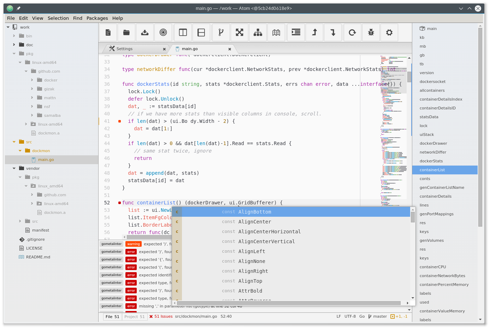

# atocker
Atom 1.2 Editor with go-tools bundled in Docker.



This docker image contains [atom](http://atom.io), [go-plus](https://github.com/joefitzgerald/go-plus)  and many go tools. The configuration conforms to
[gb](http://getgb.io/), so your project directory should conform to [this](http://getgb.io/docs/project/) layout. If there is no `vendor` directory one will be created!

You can start the editor in the project directory with `atocker`.

Please note: When using the given start script (or alias) the settings and plugins of the editor will be stored in your
`$HOME/.config/.atocker/<workspacepath>` directory.

[](https://quay.io/repository/ulrichschreiner/atocker)

Use the given `atocker` script to start an instance or create an alias:

```
_atocker() {
  docker run  \
    --rm \
    -v /etc/localtime:/etc/localtime:ro \
    -v /tmp/.X11-unix:/tmp/.X11-unix \
    -v `pwd`:/work \
    -v $HOME/.config:/config \
    -v $HOME/.gitconfig:/devhome/.gitconfig \
    --device /dev/dri \
    -e DISPLAY=$DISPLAY \
    -e HOSTUSER=`id -un` \
    -e HOSTGROUP=`id -gn` \
    -e HOSTUSERID=`id -u` \
    -e WORKSPACE=`pwd` \
    quay.io/ulrichschreiner/atocker "$1"
}
alias gbatom=_atocker
alias atm="_atocker plain"
```

Now you can use `gbatom` to start an atom editor where the needed filesystem layout will be created if it does not exist. You can also use `atm` to start a Atom editor in the current working directory without creating `src` and `vendor/src` directories.

## Included Plugins

- [go-plus](https://atom.io/packages/go-plus)
- [language-docker](https://atom.io/packages/language-docker)
- [language-protobuf](https://atom.io/packages/language-protobuf)
- [go-rename](https://atom.io/packages/go-rename)
- [file-icons](https://atom.io/packages/file-icons)
- [symbols-tree-view](https://atom.io/packages/symbols-tree-view)
- [git-plus](https://atom.io/packages/git-plus)
- [minimap](https://atom.io/packages/minimap)
- [merge-conflicts](https://atom.io/packages/merge-conflicts)
- [go-find-references](https://atom.io/packages/go-find-references)

Please note: For `git-plus` you need your correct git configuration. In my example i mount my `$HOME/.gitconfig` into the container.
